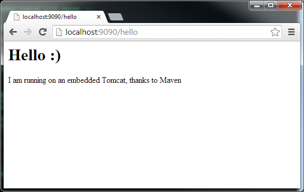

Java web application require a web container, such as Tomcat ([Homepage](http://tomcat.apache.org/)), on which these can run.  Installing and configure a web container on each developing machine may be time consuming.  Furthermore, other developers need to manage the dependencies manually if they want to run the web application.

Maven has a tomcat plugin that allows us to run an embedded tomcat instance without the need of installing a local tomcat server.

```xml
<plugin>
  <groupId>org.apache.tomcat.maven</groupId>
  <artifactId>tomcat7-maven-plugin</artifactId>
  <version>2.2</version>
</plugin>
```

Please note that this example makes use version 7 of Tomcat.  Please update where necessary if using another version of Tomcat.

Most of the examples will not contain the whole code and may omit fragments which are not relevant to the example being discussed. The readers can download or view all code from [https://github.com/javacreed/how-to-run-embedded-tomcat-with-maven](https://github.com/javacreed/how-to-run-embedded-tomcat-with-maven).

Include the Tomcat Maven Plugin as shown in the following POM example.

```xml
      <plugin>
        <groupId>org.apache.tomcat.maven</groupId>
        <artifactId>tomcat7-maven-plugin</artifactId>
        <version>2.2</version>
        <configuration>
          <port>9090</port>
          <path>/</path>
        </configuration>
      </plugin>
```

The full XML is shown next for completeness

```xml
<?xml version="1.0" encoding="UTF-8"?>
<project xmlns="http://maven.apache.org/POM/4.0.0"
  xmlns:xsi="http://www.w3.org/2001/XMLSchema-instance"
  xsi:schemaLocation="http://maven.apache.org/POM/4.0.0 http://maven.apache.org/xsd/maven-4.0.0.xsd">

  <modelVersion>4.0.0</modelVersion>
  <groupId>com.javacreed.examples</groupId>
  <artifactId>how-to-run-embedded-tomcat-with-maven</artifactId>
  <version>1.0.0</version>
  <name>How To Run Embedded Tomcat with Maven</name>
  <url>https://github.com/javacreed/${project.artifactId}</url>
  <packaging>war</packaging>

  <contributors>
    <contributor>
      <name>Albert Attard</name>
      <email>albert@javacreed.com</email>
    </contributor>
  </contributors>

  <licenses>
    <license>
      <name>The Apache Software License, Version 2.0</name>
      <url>http://www.apache.org/licenses/LICENSE-2.0.txt</url>
      <distribution>repo</distribution>
    </license>
  </licenses>

  <scm>
    <connection>scm:git:git://github.com/javacreed/${project.artifactId}.git</connection>
    <developerConnection>scm:git:git://github.com/javacreed/${project.artifactId}.git</developerConnection>
    <url>https://github.com/javacreed/${project.artifactId}</url>
  </scm>

  <properties>
    <project.build.sourceEncoding>UTF-8</project.build.sourceEncoding>
    <project.reporting.outputEncoding>UTF-8</project.reporting.outputEncoding>
    <maven.compiler.source>1.8</maven.compiler.source>
    <maven.compiler.target>1.8</maven.compiler.target>

    <surefire.version>2.20.1</surefire.version>
    <jacoco.version>0.7.9</jacoco.version>
    <reports.version>2.9</reports.version>
    <servlet.api.version>4.0.1</servlet.api.version>
    <tomcat.version>2.2</tomcat.version>
  </properties>

  <dependencies>
    <dependency>
      <groupId>javax.servlet</groupId>
      <artifactId>javax.servlet-api</artifactId>
      <version>${servlet.api.version}</version>
      <scope>provided</scope>
    </dependency>
  </dependencies>

  <build>
    <defaultGoal>clean install site versions:display-dependency-updates</defaultGoal>

    <plugins>
      <plugin>
        <groupId>org.apache.tomcat.maven</groupId>
        <artifactId>tomcat7-maven-plugin</artifactId>
        <version>${tomcat.version}</version>
        <configuration>
          <port>9090</port>
          <path>/</path>
        </configuration>
      </plugin>

      <plugin>
        <groupId>org.apache.maven.plugins</groupId>
        <artifactId>maven-surefire-plugin</artifactId>
        <version>${surefire.version}</version>
        <configuration>
          <!-- Sets the VM argument line used when unit tests are run. -->
          <argLine>${surefireArgLine}</argLine>
          <!-- Skips unit tests if the value of skip.unit.tests property
            is true -->
          <skipTests>${skip.unit.tests}</skipTests>
        </configuration>
      </plugin>

      <plugin>
        <groupId>org.jacoco</groupId>
        <artifactId>jacoco-maven-plugin</artifactId>
        <version>${jacoco.version}</version>
        <executions>
          <!-- Prepares the property pointing to the JaCoCo runtime agent
            which is passed as VM argument when Maven the Surefire plugin is executed. -->
          <execution>
            <id>pre-unit-test</id>
            <goals>
              <goal>prepare-agent</goal>
            </goals>
            <configuration>
              <!-- Sets the path to the file which contains the execution
                data. -->
              <destFile>${project.build.directory}/coverage-reports/jacoco-ut.exec</destFile>
              <!-- Sets the name of the property containing the settings
                for JaCoCo runtime agent. -->
              <propertyName>surefireArgLine</propertyName>
            </configuration>
          </execution>
          <!-- Ensures that the code coverage report for unit tests is created
            after unit tests have been run. -->
          <execution>
            <id>post-unit-test</id>
            <phase>test</phase>
            <goals>
              <goal>report</goal>
            </goals>
            <configuration>
              <!-- Sets the path to the file which contains the execution
                data. -->
              <dataFile>${project.build.directory}/coverage-reports/jacoco-ut.exec</dataFile>
              <!-- Sets the output directory for the code coverage report. -->
              <outputDirectory>${project.reporting.outputDirectory}/jacoco-ut</outputDirectory>
            </configuration>
          </execution>
        </executions>
      </plugin>
    </plugins>
  </build>

  <reporting>
    <plugins>
      <plugin>
        <groupId>org.apache.maven.plugins</groupId>
        <artifactId>maven-project-info-reports-plugin</artifactId>
        <version>${reports.version}</version>
        <configuration>
          <dependencyLocationsEnabled>false</dependencyLocationsEnabled>
        </configuration>
      </plugin>

      <plugin>
        <groupId>org.jacoco</groupId>
        <artifactId>jacoco-maven-plugin</artifactId>
        <version>${jacoco.version}</version>
        <configuration>
          <!-- Sets the path to the file which contains the execution data. -->
          <dataFile>${project.build.directory}/coverage-reports/jacoco-ut.exec</dataFile>
        </configuration>
        <reportSets>
          <reportSet>
            <reports>
              <!-- select non-aggregate reports -->
              <report>report</report>
            </reports>
          </reportSet>
        </reportSets>
      </plugin>
    </plugins>
  </reporting>
</project>
```

Please note that the above configuration will start the embedded Tomcat instance on port `9090`.  You can change the port as required.


Build the project

```
mvn clean install
```

Start the embedded Tomcat server.

```
mvn tomcat7:run
```

This will produce something similar to the following.

```
[INFO] Scanning for projects...
[INFO]
[INFO] ------------------------------------------------------------------------
[INFO] Building How To Run Embedded Tomcat with Maven 0.0.1-SNAPSHOT
[INFO] ------------------------------------------------------------------------
[INFO]
[INFO] >>> tomcat7-maven-plugin:2.2:run (default-cli) @ how-to-run-embedded-tomcat-with-maven >>>
[INFO]
[INFO] --- maven-resources-plugin:2.6:resources (default-resources) @ how-to-run-embedded-tomcat-with-maven ---
[INFO] Using 'UTF-8' encoding to copy filtered resources.
[INFO] Copying 0 resource
[INFO]
[INFO] --- maven-compiler-plugin:2.3.2:compile (default-compile) @ how-to-run-embedded-tomcat-with-maven ---
[INFO] Nothing to compile - all classes are up to date
[INFO]
[INFO] <<< tomcat7-maven-plugin:2.2:run (default-cli) @ how-to-run-embedded-tomcat-with-maven <<<
[INFO]
[INFO] --- tomcat7-maven-plugin:2.2:run (default-cli) @ how-to-run-embedded-tomcat-with-maven ---
[INFO] Running war on http://localhost:9090/
[INFO] Creating Tomcat server configuration at C:\JavaCreed\examples\maven\How To Run Embedded Tomcat with Maven\target\tomcat
[INFO] create webapp with contextPath:
Mar 20, 2014 4:00:05 PM org.apache.coyote.AbstractProtocol init
INFO: Initializing ProtocolHandler ["http-bio-9090"]
Mar 20, 2014 4:00:05 PM org.apache.catalina.core.StandardService startInternal
INFO: Starting service Tomcat
Mar 20, 2014 4:00:05 PM org.apache.catalina.core.StandardEngine startInternal
INFO: Starting Servlet Engine: Apache Tomcat/7.0.47
Mar 20, 2014 4:00:07 PM org.apache.coyote.AbstractProtocol start
INFO: Starting ProtocolHandler ["http-bio-9090"]
```

Please note that when executed for the first time, Maven may download any missing components and thus may produce more output than that shown above.

Open the browser.

```
http://localhost:9090/hello
```

You should see something similar to the following



We managed to run a Java web application without having to install a web server such as Tomcat.  The reader can checkout the project as [https://github.com/javacreed/how-to-run-embedded-tomcat-with-maven](https://github.com/javacreed/how-to-run-embedded-tomcat-with-maven).
